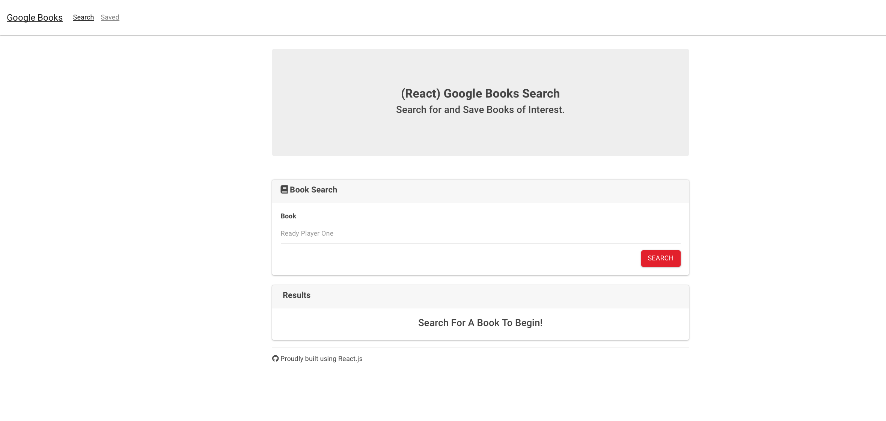
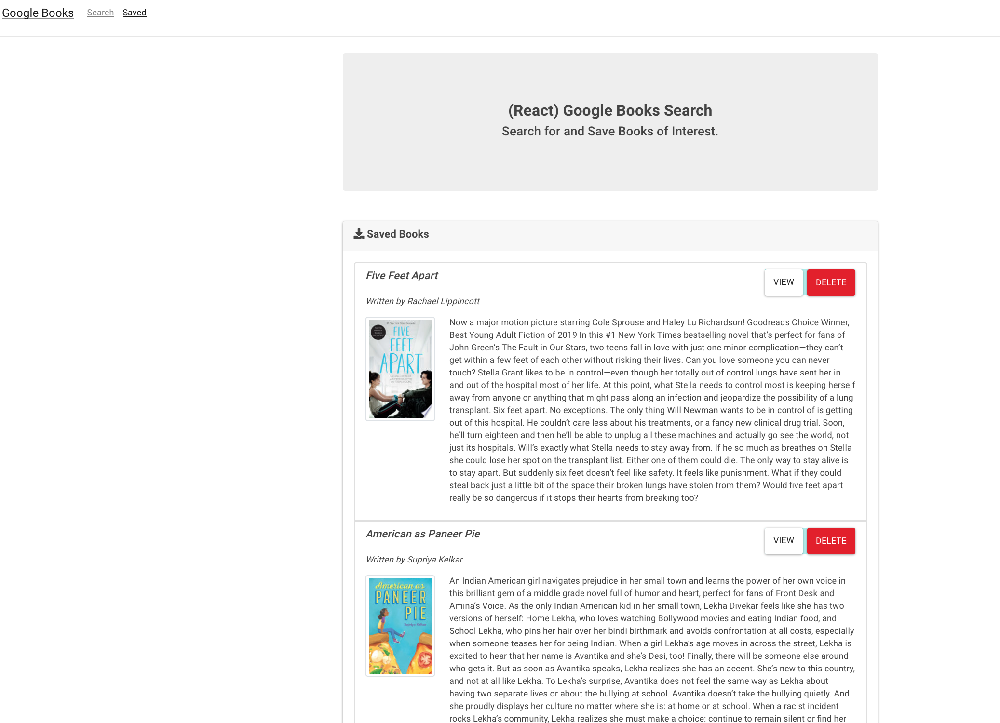

# This is the link to deploy. Using Heruko to run the app.

https://tranquil-woodland-21979.herokuapp.com/

# This is the link to the github repo:
https://github.com/SINCHOCHAN/hw21

# This is the link to the live website:

https://sinchochan.github.io/hw21/

# PROJECT TITLE
Unit 21 Google Books Search

### Overview

In this activity, you'll create a new React-based Google Books Search app. This assignment requires you to create React components, work with helper/util functions, and utilize React lifecycle methods to query and display books based on user searches. You'll also use Node, Express and MongoDB so that users can save books to review or purchase later.

# How to run (screenshot)

